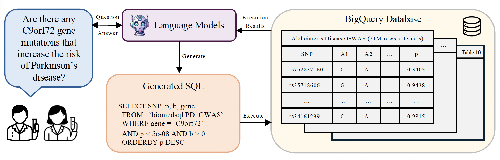

# BiomedSQL: Text-to-SQL for Scientific Reasoning on Biomedical Knowledge Bases 



<p align="center"><em>Overview of text-to-SQL workflow used to evaluate LLMs on BiomedSQL.</em></p>

## Requirements

We provide conda environment.yml and requirements.txt files for both MacOS and Linux.

To install requirements, we recommend creating a new environment with conda:
```setup
conda env create -f mac_environment.yml
```

Or install via pip:

```setup
pip install -r mac_requirements.txt
```

## Environment Setup

BiomedSQL requires the extensive use of both opened a closed source LLMs. The following services are needed to run the full set of experiments:

* AzureOpenAI (with endpoints for gpt-4o, gpt-4o-mini, and gpt-o3-mini)
* AzureAI (with an endpoint for Meta-Llama-405B)
* Gemini (for access to gemini-2.0-flash and gemini-2.0-flash-lite)
* OpenAI (for access to the general completions() API for use in the Schema Indexing interaction paradigm)
* Anthtropic (for access to claude-3-7-sonnet)
* HuggingFace (for access to gated Meta-Llama repositories)

See ```config/sample.env``` for a complete list of specific information needed from each provider. Once complete, please move this file to ```config/.env``` for seamless use in the current experiment setup.

## Benchmark Dataset

Our benchmark dataset and associated database tabular data can be found on [HuggingFace](https://huggingface.co/datasets/NIH-CARD/BiomedSQL).

## BigQuery Database Creation

Coming soon we will provide code to create a fresh BigQuery Database from the parquet files available along with the BiomedSQL benchmark on HuggingFace.

Reviewers will be provided with a pre-configured ```config/service_account.json``` file for access to the current database.

## LLM Experiments

To run the isolated SQL generation experiments for BiomedSQL, run:

```isolated sql generation
python run_llm_experiments.py
```

Currently we use the following open-source models and detail the following compute requirements to run our experiment pipeline as-is:
* meta-llama/Llama-3.1-70B-Instruct (three NVIDIA 80GB A100 GPUs)
* Qwen/Qwen2.5-Coder-32B-Instruct (two NVIDIA 80GB A100 GPUs)
* Qwen/Qwen2.5-Coder-14B-Instruct (two NVIDIA 80GB A100 GPUs)

We understand that GPU access may differ from user to user, so in order to run our experiments without the need for GPUs, please comment out any models specified with ```provider: huggingface``` under the ```experiment_models``` section of ```config/llm_config.yaml```.

## Interaction Paradigm Experiments

To run the interaction paradigm experiments for BiomedSQL, run:

```interaction paradigm
python run_interaction_experiments.py
```

## Results

To generate results figures and tables after experiments finished, run:

```results
python results.py
```

Tables will show up in ```results``` and plots will show up in ```results/plots```.

## Results

On BiomedSQL, GPT-o3-mini is consistently the top-performing model on the variety of experiments performed. However, even when paired with our custom-built text-to-SQL system (BMSQL), it still falls short of domain-expert level performance.

| Model name             | Execution Accuracy    | Response Quality Rate |
| ---------------------- | --------------------- | --------------------- |
| GPT-o3-mini-baseline   |        53.5%          |          73.3%        |
| GPT-o3-mini-combo      |        59.0%          |          77.8%        |
| BMSQL-GPT-o3-mini      |        62.6%          |          84.6%        |


## License and Contributing

This respository is under the Apache License (Version 2.0). To contribute, simply clone the repository and open a pull request!

Happy benchmarking!
